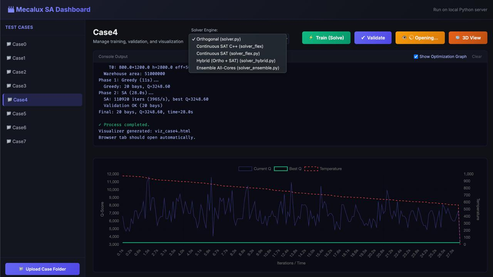
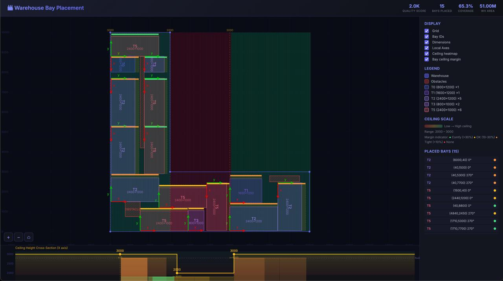
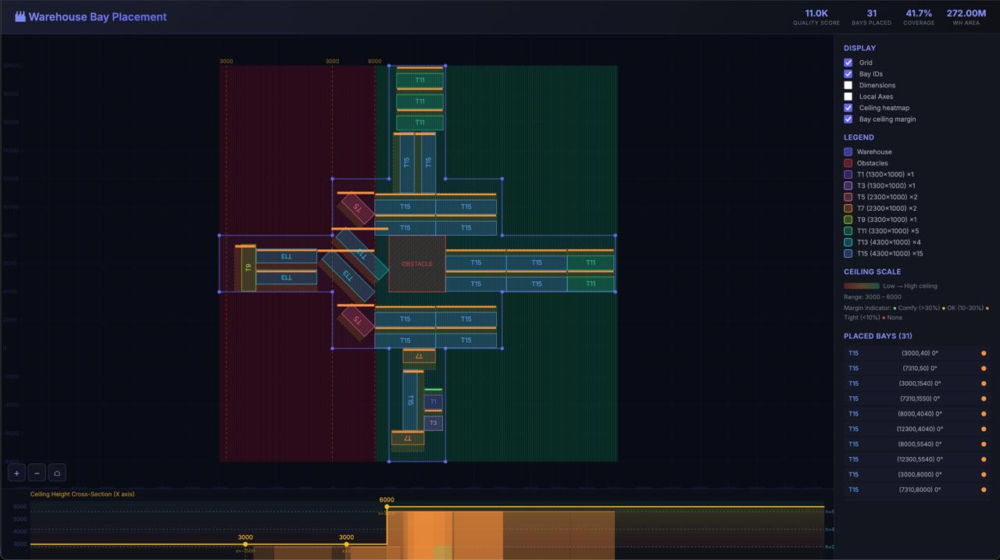
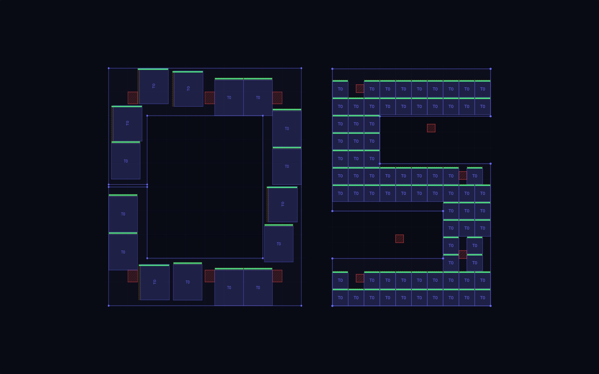
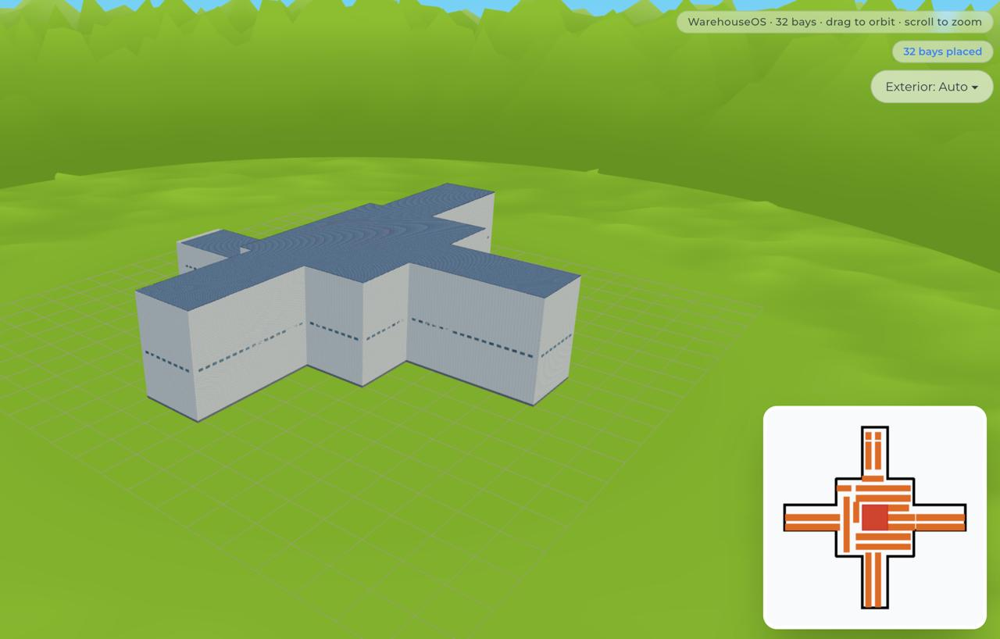
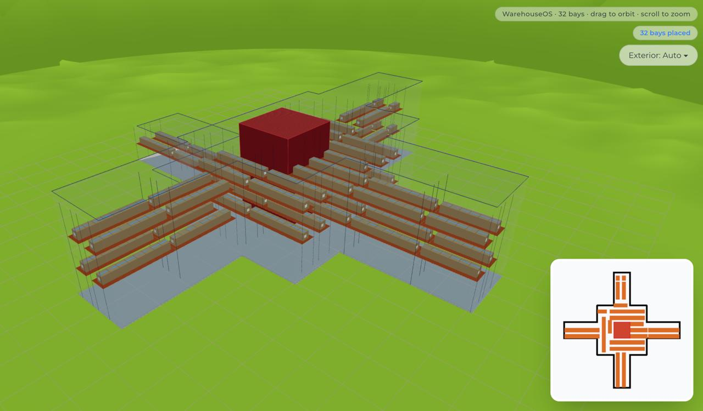
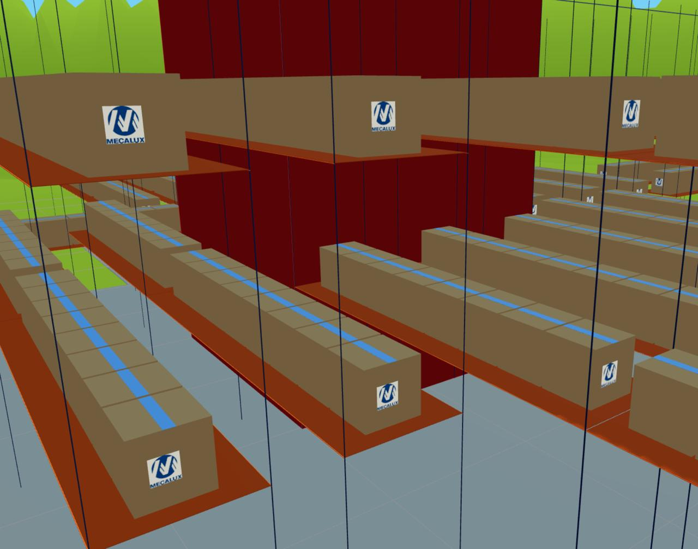

# HackUPC 2026 — Mecalux Challenge

To run the whole application execute:

```bash
(cd SA && python3 dashboard.py) & (cd warehouse-os && npm run dev)
```

This starts two things in parallel:
- **SA Dashboard** — the main interface, served at `http://localhost:8000`
- **3D Viewer** — a supplementary view, served at `http://localhost:3000`

---

## Project Structure

```
PublicTestCases/      # Input scenarios (CSV files)
SA/                   # Main application: dashboard, solvers, validator, visualizer
warehouse-os/         # Supplementary 3D viewer (Next.js)
```

---

## SA Dashboard (`http://localhost:8000`)

`dashboard.py` is the main interface. It starts a local HTTP server and opens the browser automatically. All solver execution is triggered from here.






### Sidebar — Test case list
Lists every folder found in `PublicTestCases/`. Clicking one selects it and enables the three action buttons. You can also upload new case folders directly through the UI.

### Solver engine dropdown
Chooses which solver is launched when you click **Train (Solve)**:

| Option | Script |
|---|---|
| Orthogonal | `solver.py` |
| Continuous SAT (Python) | `solver_flex.py` |
| Continuous SAT (C++) | `solver_flex` (compiled binary) |
| Hybrid (Ortho + SAT) | `solver_hybrid.py` |
| Ensemble All-Cores | `solver_ensemble.py` |

For full documentation of the algorithms see [SA/README.md](SA/README.md).

### Train (Solve)
Spawns the selected solver as a subprocess:

```
python3 <solver> warehouse.csv obstacles.csv ceiling.csv types_of_bays.csv output_caseN.csv
```

The solver's stdout is streamed to the browser in real time via Server-Sent Events and shown in the console panel. If **Show Optimization Graph** is checked, a live chart plots the SA quality score (current Q, best Q) and annealing temperature as the solver runs.

Output is written to `SA/output_caseN.csv`.

### Validate
Runs `validator.py` against the existing `output_caseN.csv` and the original input CSVs. Checks all spatial constraints and reports the quality score Q. Result is printed in the console panel.

### Visualize
Runs `visualize.py`, which generates a standalone `SA/viz_caseN.html` file with an interactive 2D floor-plan of the placed bays, and opens it automatically in the browser.

---

## 3D Viewer (`http://localhost:3000`)

`warehouse-os` is a Next.js 16 app that offers an alternative, interactive 3D view of any warehouse scenario.

### Upload screen
On first load the app shows an upload screen with:
- **Algorithm toggle** — C++ (Fast) or Python
- **Four CSV upload cards** for manual upload of any custom case

Once all four files are provided, the app automatically POSTs them to the SA server (`http://localhost:8000/solve`) with the chosen algorithm and waits for the solver result.

### 3D scene
After the solve completes the scene is rendered with:




- Interactive orbit camera (drag to rotate, scroll to zoom)
- Warehouse floor, walls with procedural windows, and stepped ceiling panels
- Placed bay rows in correct positions and orientations
- Obstacle boxes
- A **picture-in-picture mini-map** in the corner showing the opposite view mode (click it to toggle between 3D and floor-plan)
- An **Exterior** dropdown (Auto / Hidden / Translucent) to control wall visibility
- An **Info panel** that appears when a bay is clicked, showing its dimensions, load count, and price

---

## Input Files (`PublicTestCases/`)

Each test case folder (`Case0` – `Case7`) contains up to four CSV files.

### `warehouse.csv`
Ordered polygon vertices defining the warehouse footprint. Implicitly closed.

| Column | Description |
|---|---|
| `x` | X coordinate (mm) |
| `y` | Y coordinate (mm) |

### `obstacles.csv`
Rectangular blocked zones (columns, pillars, etc.).

| Column | Description |
|---|---|
| `x` | X coordinate of the obstacle origin (mm) |
| `y` | Y coordinate of the obstacle origin (mm) |
| `width` | Width (mm) |
| `depth` | Depth (mm) |

### `ceiling.csv`
Step-function ceiling height profile along the X axis. The last segment applies to the end of the warehouse.

| Column | Description |
|---|---|
| `xFrom` | X position where this height starts (mm) |
| `maxHeight` | Maximum usable height from this X onward (mm) |

### `types_of_bays.csv`
Catalog of available storage bay types.

| Column | Description |
|---|---|
| `typeId` | Unique integer identifier |
| `width` | Bay width (mm) |
| `depth` | Bay depth (mm) |
| `height` | Bay height (mm) — must fit under the ceiling |
| `gap` | Aisle clearance added behind the bay (mm) |
| `nLoads` | Number of pallet load positions |
| `price` | Revenue value of placing this bay type (€) |

### `output_caseN.csv` *(generated)*
Written by the solver into `SA/` after a solve run. Used as input by the validator and the 2D visualizer.
